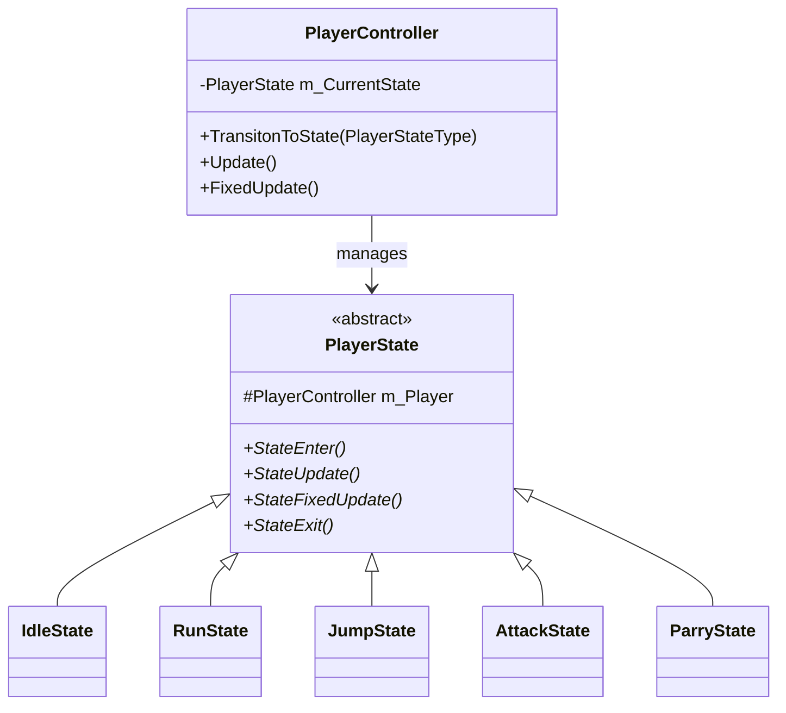
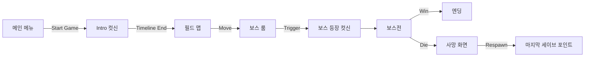
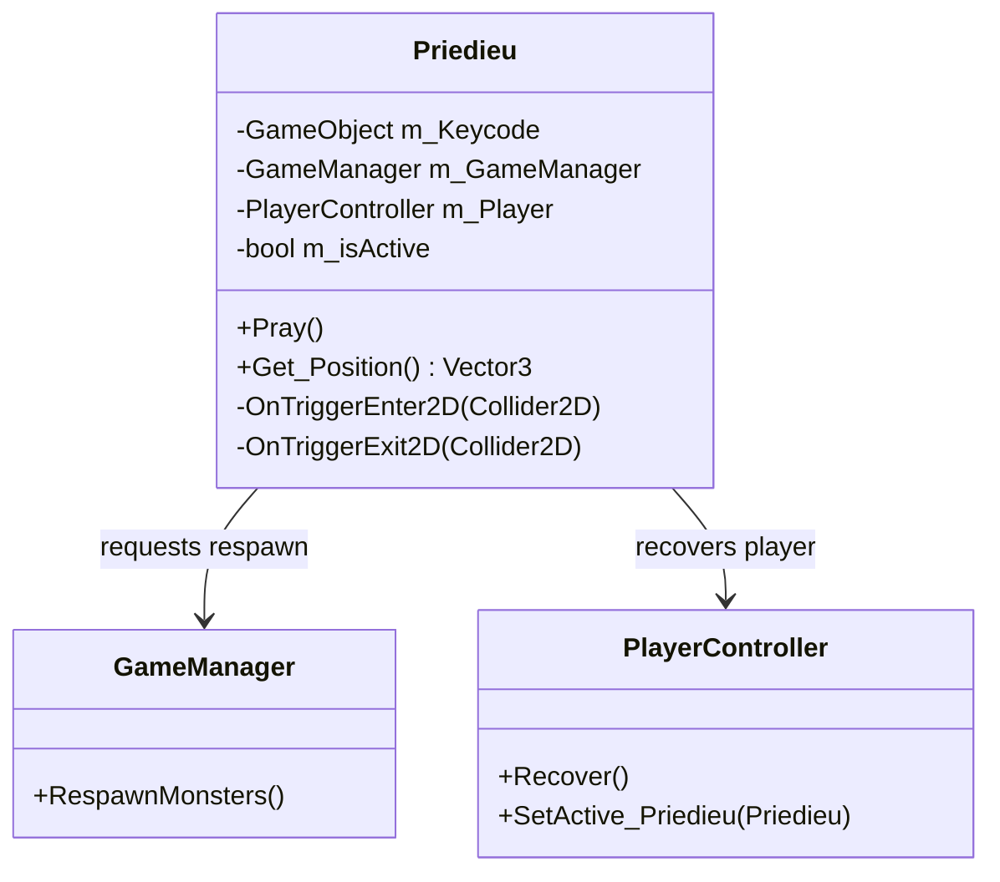

# Blasphemous 모작 - Unity 2D Portfolio

## 목차 (Table of Contents)

- [프로젝트 개요](#-프로젝트-개요)
  - [개발 동기 및 목표](#개발-동기-및-목표)
- [주요 역할 및 성과](#-주요-역할-및-성과)
- [시스템 아키텍처](#-시스템-아키텍처)
  - [1. FSM (Finite State Machine)](#1-fsm-finite-state-machine)
  - [2. 게임 진행 흐름](#2-게임-진행-흐름)
- [주요 구현 내용](#-주요-구현-내용)
  - [1. Intro & Cutscene](#1-intro--cutscene)
  - [2. Parry 시스템](#2-parry-시스템)
  - [3. Save Point (기도대)](#3-save-point-기도대)
- [코드 구조](#-코드-구조)
- [학습 및 성장](#-학습-및-성장)

---

## 프로젝트 개요

**프로젝트명**: Blasphemous 모작  
**엔진**: Unity 2022.3 (C#)  
**장르**: 2D Action Platformer (Metroidvania)  
**개발 기간**: [2024.04.30 ~ 2025.05.20]  
**개발 인원**: 1인 개인 프로젝트

### 개발 동기 및 목표

#### 배경
Blasphemous (2019)의 독특한 아트 스타일과 하드코어한 액션성을 Unity로 재현하며 2D 게임 개발의 전반적인 프로세스를 익히고자 했습니다.

#### 핵심 목표
1.  **FSM 기반 캐릭터 제어**: 복잡한 액션(공격, 패링, 회피 등)을 상태 패턴으로 체계적으로 관리
2.  **타임라인 연출**: 시네마틱 컷신과 인게임 플레이의 자연스러운 전환 구현
3.  **핵심 메카닉 구현**: 패링, 세이브 포인트(기도대), 보스전 등 장르적 특징 구현

---

## 주요 역할 및 성과

### 핵심 시스템 구현
- **FSM 설계**: `PlayerState` 추상 클래스를 활용한 확장 가능한 상태 패턴 구현
- **전투 시스템**: 콤보 공격, 점프 공격, 패링 및 반격(Parry Counter) 구현
- **연출 시스템**: Unity Timeline을 활용한 오프닝 및 보스 등장 컷신 제작
- **데이터 관리**: `ScriptableObject` 및 `PlayerPrefs`를 활용한 데이터 저장/로드

---

## 시스템 아키텍처

### 1. FSM (Finite State Machine)

플레이어의 상태를 객체지향적으로 분리하여 관리합니다.



### 2. 게임 진행 흐름

메인 메뉴부터 보스전까지의 게임 루프입니다.



### 3. Save Point (기도대) 구조

세이브 포인트와 관련된 클래스 간의 상호작용입니다.



---

## 주요 구현 내용

### 1. Intro & Cutscene

게임 시작 시 동영상과 타임라인을 활용하여 몰입감 있는 인트로를 구성했습니다.

- **구성**: Video Player (영상) -> Playable Director (타임라인) -> In-game 전환
- **특징**: 카메라가 위에서 아래로 내려오는 연출을 통해 게임의 분위기 조성

### 2. Parry 시스템

정확한 타이밍에 공격을 막아내는 패링 시스템을 구현했습니다.

- **구현 방식**:
    - `Parry` 애니메이션 실행 시 특정 프레임에서 `HitBoxCollider`를 비활성화하고 `ParryCollider`를 활성화
    - 적의 공격이 `ParryCollider`에 닿으면 패링 성공 판정 및 반격(Counter) 기회 부여
- **코드 스니펫**:
```csharp
public void Parry_Collider_On()
{
    m_HitCollider.enabled = false;
    m_ParryColider.enabled = true;
}
```

### 3. Save Point (기도대)

세이브 포인트(Priedieu) 상호작용 시 상태를 저장하고 회복합니다.

- **기능**:
    - 체력 및 포션 완전 회복
    - 현재 위치를 리스폰 지점으로 설정
    - 사망한 몬스터 리스폰 (초기화)
- **사망 처리**: 플레이어 사망 시 `GameManager`를 통해 마지막 세이브 포인트에서 부활

---

## 코드 구조

```
Scripts/
├── Player/
│   ├── PlayerController.cs    # 메인 컨트롤러
│   ├── PlayerState.cs         # 상태 패턴 베이스
│   └── PlayerState/           # 상태별 클래스 (Idle, Run, Attack...)
├── Manager/
│   ├── GameManager.cs         # 게임 루프 및 점수 관리
│   ├── GameSceneManager.cs    # 씬 전환 관리
│   └── AudioManager.cs        # 사운드 관리
├── Enemy/                     # 적 AI 및 상태
├── Objects/                   # 상호작용 오브젝트 (기도대 등)
└── UI/                        # UI 관련 스크립트
```

---

## 학습 및 성장

### 기술적 성취
- **Unity 엔진 숙련도 향상**: 2D 물리, 애니메이션, 타임라인 등 다양한 기능 활용
- **디자인 패턴 적용**: FSM 패턴을 직접 구현하며 객체지향 설계의 장점 체감
- **문제 해결**: 애니메이션 이벤트와 콜라이더 제어를 통한 정교한 판정 구현

### 향후 개선 방향
- [ ] 인벤토리 및 아이템 시스템 추가
- [ ] 다양한 종류의 적과 패턴 추가
- [ ] UI/UX 개선 및 최적화
